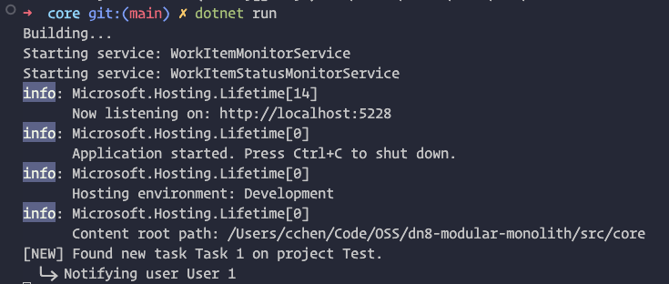
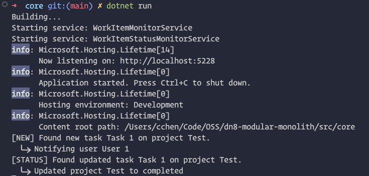

# A Practical Guide to Modular Monoliths (MoMo) with .NET

This repo is inspired by [a new paper](https://dl.acm.org/doi/pdf/10.1145/3593856.3595909) titled *Towards Modern Development of Cloud Applications* released by a team at Google.

The objective is to provide real working code so that anyone can build a modular monolith in .NET that has great DX and is easy to partition, deploy, and scale in production.

## Read the Background

.NET’s host runtime model and built-in dependency injection makes building scalable “modular monoliths” easier than ever. This lets teams — especially startups — move faster with less development, deployment, and operational friction while still maintaining many of the benefits of microservices such as independent scaling of services, isolation of responsibilities, and so on.

⮑ Read more here: **[A Practical Guide to Modular Monoliths with .NET](https://chrlschn.dev/blog/2024/01/a-practical-guide-to-modular-monoliths/)**

In short, the objective is to:

- Have a monolithic codebase (can be multi-project; this example is just a single project) to simplify local setup and improve DX
- Have a single runtime in development so that `dotnet run` brings up everything
- Design our runtime so that we can use the same exact codebase, but deploy different sets of services to different hosts that we can route, secure, scale, and manage independently

## Running the Sample

> 💡 This sample repo is a very "naive" implementation that uses simple database level signaling.  In a more robust system, we could use Postgres queues or an external service bus like SQS or Google Pub/Sub.

To run the sample in this repository, you'll need to have Docker installed.

There are two modes:

1. **Development mode**.  In this mode, we run all of the services in one single host.  This makes for really good DX because there's only one process to start and one process to debug.  A single `dotnet run` will bring up everything.
2. **Runtime mode**. In this mode, we run each of the services in separate hosts as if emulating how it would be "upstream" in production.  This allows us to scale the different roles independently by assigning different roles to the different servers.

### Development Mode

To run in development mode:

```shell
# Start the Postgres container
docker compose up

# API is at port 5228
cd src/core
dotnet run
```

In this mode, the Docker Compose file is responsible only for running our Postgres containers.  We load all of our services into a single .NET host runtime which includes our REST API as well as our two background services which perform notification and updates to the `Project`.

### Runtime Mode

To run in runtime mode (as it would be in production):

```shell
# API is at port 8080
docker compose -f docker-compose-run.yaml up --build
```

In this mode, the Docker Compose file is responsible for building and running 4 containers:

1. Postgres
2. The .NET host for the API; we don't load the other services
3. The .NET host for the service to notify `WorkItem` collaborator `User`s
4. The .NET host for the service to check and update the `Project` for a `WorkItem` if all of the `Project`'s `WorkItem`s are completed.

Each container contains a host that loads a slice of the workload.

### Testing

To test the example, use the following URLs to access the Swagger UI:

```
# In development mode
http://localhost:5228/swagger

# In runtime mode
http://localhost:8080/swagger
```

From here, follow these steps:

1. Add a **Project** and get the ID from the response
2. Add a **User** and keep the ID of the user
3. Add a **Work Item** and link it to the **Project** and **User**
4. The service `WorkItemMonitorService` will detect the new **Work Item** and simulate sending notifications to the collaborators
5. Update the status of the **Work Item** to **Completed**
6. The service `WorkItemStatusMonitorService` will detect changes in **Work Item** status and check the **Project** to see if all of the **Work Item**s are completed and if so, update the status of the **Project** to **Completed** as well.

To execute this in `curl`:

```bash
# Add the project and note the response ID
curl -X 'POST' \
  'http://localhost:5228/api/projects/add' \
  -H 'accept: text/plain' \
  -H 'Content-Type: application/json' \
  -d '"Test"'

# Assume we get an ID of 8b90f42c-af9f-4c61-9b18-52e764f0ca8c

# Add a user:
curl -X 'POST' \
  'http://localhost:5228/api/users/add' \
  -H 'accept: text/plain' \
  -H 'Content-Type: application/json' \
  -d '{
  "id": "3fa85f64-5717-4562-b3fc-2c963f66afa6",
  "name": "User 1",
  "createdUtc": "2024-01-14T23:45:38.591Z",
  "email": "user1@example.com"
}'

# Now add a work item using the project ID and user ID:
curl -X 'POST' \
  'http://localhost:5228/api/tasks/add' \
  -H 'accept: text/plain' \
  -H 'Content-Type: application/json' \
  -d '{
  "projectId": "8b90f42c-af9f-4c61-9b18-52e764f0ca8c",
  "name": "Task 1",
  "collaborators": [
    "3fa85f64-5717-4562-b3fc-2c963f66afa6"
  ]
}'

# Assume we get an ID of: faba6123-183d-405d-8751-9736ed4a243b

# This will log:
# [NEW] Found new task Task 1 on project Test
#   ⮑  Notifying user User 1

# Finally, let's update the status with our work item ID:
curl -X 'POST' \
  'http://localhost:5228/api/tasks/faba6123-183d-405d-8751-9736ed4a243b/status' \
  -H 'accept: text/plain' \
  -H 'Content-Type: application/json' \
  -d '"Completed"'
```

Console output when a new task is detected:



Console output when the task status is updated to `Completed`:



## Multiple Web Service APIs

In this project, I've set up an example of how to output two different sets of OpenAPI endpoints based on whether it's an "admin" or "default" function.

This is done using the code in `SetupSwaggerExtension.cs` and the code in `Program.cs`:

```cs
// Program.cs
if (RuntimeEnv.IsDevelopment)
{
    app.UseSwagger();
    app.UseSwaggerUI(options =>
    {
        options.ShowCommonExtensions();

        // Set up the endpoints
        options.SwaggerEndpoint("v1-api/swagger.json", "Default API");
        options.SwaggerEndpoint("v1-admin/swagger.json", "Admin API");
    });
}
```

This requires that we label our APIs like so using `ApiExplorerSettings.GroupName`:

```cs
// AdminController.cs
// 👇 Note here we are specifically identify a group name
[ApiExplorerSettings(GroupName = Constants.AdminApiGroup)]
[HttpDelete("/api/users/delete/{userId}", Name = nameof(DeleteUser))]
public async Task DeleteUser(Guid userId) { /* ... */ }

// UserController.cs
// 👇 Note here we are specifically identify a group name
[ApiExplorerSettings(GroupName = Constants.DefaultApiGroup)]
[HttpGet("/api/users", Name = nameof(GetUsers))]
public async Task<IEnumerable<User>> GetUsers() { /* ... */ }
```

You can load the APIs from the Swagger UI: `https://localhost:5228/swagger`

To generate the OpenAPI documents, you'll need to configure and set up the Swagger CLI (if you're interested in .NET 9 tooling, check out [.NET 9 OpenAPI + TypeScript Client Generation](https://github.com/CharlieDigital/dn9-openapi-codegen))

For .NET 8:

```bash
dotnet new tool-manifest
dotnet tool install Swashbuckle.AspNetCore.Cli --version 6.9.0
```

If you run the following commands, you can generate the OpenAPI spec and use that to generate TypeScript bindings, for example:

```bash
# 👉 See the config in src/core/core.csproj to understand how this works

# Linux, macOS
GEN=true dotnet build

# Linux, macOS, Windows
set GEN=true
dotnet build
```

This will output the files to `src/api-spec` which can be used to generate TypeScript bindings, for example.

### Loading Different Controllers at Runtime

The previous config will still load both sets of controllers (admin and the main API).

In practice, there are multiple ways that this can be achieved without segregating services and using a monolith.  I recommend using your judgement on the appropriate level of complexity for your use cases.

For example, it is possible to simply route some traffic like `https://users.example.com` to one set of nodes and `https://items.example.com` to another set of nodes.  This would still allow tuning of services by different concerns in terms of scaling the servers (e.g. `items` needs bigger instances while `users` can use smaller ones).

However, if runtime isolation is important, we can also segregate the services explicitly at runtime.  This is done in the `Setup/AddCustomControllers` class where we detect if there is an environment variable that defines the enabled routes (`ENABLE_ADMIN_ROUTES` and/or `ENABLE_DEFAULT_ROUTES`) and then decide which controller types we load using a custom loader.

```cs
// SetupControllersExtension.cs
var loadAdminControllers =
    Environment.GetEnvironmentVariable("ENABLE_ADMIN_ROUTES") == "true";
var loadApiControllers =
    Environment.GetEnvironmentVariable("ENABLE_DEFAULT_ROUTES") == "true";

var enabledControllers = new List<Type>();

if (loadAdminControllers) // Load admin controller
{
    enabledControllers.Add(typeof(AdminController));
}

if (loadApiControllers) // Load API controllers
{
    enabledControllers.Add(typeof(ProjectController));
    enabledControllers.Add(typeof(UserController));
    enabledControllers.Add(typeof(WorkItemController));
}
```

In this example, we are loading types from a single assembly, but it is also possible to load types from any number of assemblies allowing you to, for example, have a separate project for `MoMo.Api.Admin`, `MoMo.Api.Core`, and `MoMo.Api.Reporting`.

You can be more clever here and write better code to resolve/filter the types to load or add more options here to load different sets of services.

In local development, when no environment variable is provided, it just follows the normal loading logic and all routes are loaded.

With this approach, now you can map (macOS commands):

- `https://api.example.com` → a set of nodes running `ENABLE_DEFAULT_ROUTES=true dotnet run`
- `https://admin-api.example.com` → a set of nodes running `ENABLE_ADMIN_ROUTES=true dotnet run`

So that each set of nodes only exposes the relevant routes.
